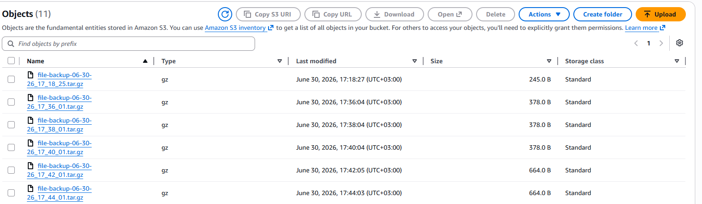
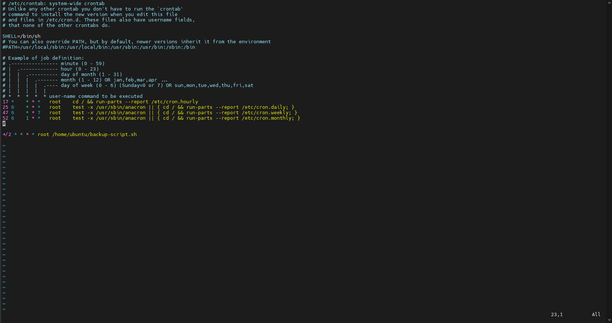
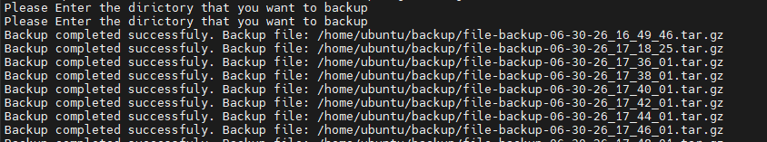

# AWS S3 Backup Automation

## Project Overview

This project automates the process of backing up a directory on a Linux EC2 instance. The script compresses the selected directory into a `.tar.gz` archive, logs the backup process, uploads the backup to an Amazon S3 bucket using the AWS CLI, and can be scheduled automatically using Cron.

---

## Features

- Compress directories into `.tar.gz` archives.
- Upload backups automatically to Amazon S3.
- Generate log files for backup operations.
- Validate user input.
- Check whether AWS CLI is installed.
- Automate execution using Cron.
- Timestamped backup filenames.

---

## Technologies Used

- Bash
- Linux (Ubuntu)
- AWS EC2
- Amazon S3
- AWS CLI
- Cron
- tar
- gzip

---

## Prerequisites

Before running the project, make sure you have:

- Ubuntu/Linux environment
- AWS CLI installed
- AWS credentials configured
- An S3 bucket
- IAM permissions for S3
- Cron installed

---

## How to Run

Clone the repository:

```bash
git clone https://github.com/UlaimanW/aws-s3-backup-automation.git
```

Make the script executable:

```bash
chmod +x backup-script.sh
```

Run the script:

```bash
./backup-script.sh /path/to/directory
```

---

## Cron Automation

Example Cron job:

```cron
*/2 * * * * root /home/ubuntu/backup-script.sh
```

This runs the backup every 2 minutes.

---

## Example Output

```
Backup completed successfully.
Backup file:
/home/ubuntu/backup/file-backup-07-01-26_18_30_11.tar.gz

File uploaded successfully to the S3 bucket.
```

---

## Screenshots


### Upload to Amazon S3

The generated backup archive is uploaded successfully to an Amazon S3 bucket.




### Cron Automation

The backup script is scheduled to run automatically every two minutes using Cron.




### Log File

The script records backup operations and status messages in a log file.




---
